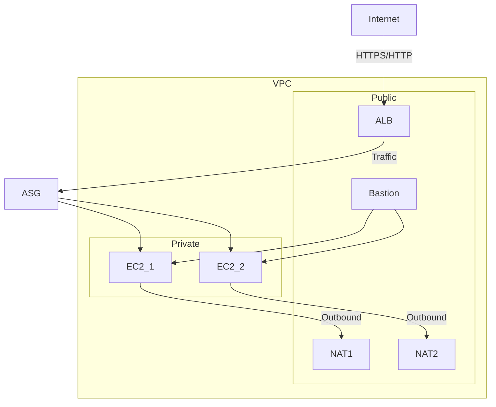

# 🏗️ AWS VPC Production Setup Documentation

This project demonstrates the setup of a production-grade VPC architecture in AWS. The design ensures high availability, security, scalability, and fault tolerance by using multiple subnets across two Availability Zones (AZs), an Auto Scaling Group, an Application Load Balancer, NAT Gateways, and a Bastion Host.

---

## 🌐 Architecture Overview

The architecture includes:

- **VPC** with 2 Availability Zones for high availability.
- **2 Public Subnets** (one in each AZ) for external-facing components.
- **2 Private Subnets** (one in each AZ) for application servers.
- **Internet Gateway** for public internet access.
- **2 NAT Gateways** (one per AZ) to provide outbound internet to private subnets.
- **Application Load Balancer (ALB)** in public subnets to distribute traffic.
- **Auto Scaling Group (ASG)** in private subnets to manage EC2 instances.
- **Bastion Host** in public subnet to securely access private resources.
- **Route Tables** for controlling traffic flow.

---

## 🔑 Components and Their Purpose

### 1. Virtual Private Cloud (VPC)
A logically isolated network in AWS where you launch all your resources.
**Purpose:**
- Provides IP address space for networking.
- Lets you control routing, security, and subnet design.
- Example CIDR: `10.0.0.0/16`.

### 2. Subnets
**Public Subnets (2, one per AZ):**
- Host internet-facing resources like ALB and Bastion Host.
- Associated with a route table that routes traffic to the Internet Gateway.

**Private Subnets (2, one per AZ):**
- Host EC2 instances in ASG.
- Route internet traffic through the NAT Gateway, not directly.

**Why 2 in each AZ?**
- For fault tolerance: if one AZ goes down, the other continues serving traffic.

### 3. Internet Gateway (IGW)
Connects the VPC to the internet.
Required for resources in public subnets to communicate externally.
Attached at the VPC level.

### 4. NAT Gateways (2)
Allow instances in private subnets to:
- Download updates.
- Access external APIs.
- Prevents inbound connections from the internet.
One NAT Gateway per AZ = high availability.

### 5. Route Tables
**Public Route Table:**
- Routes `0.0.0.0/0` → Internet Gateway.
- Used by public subnets.

**Private Route Table(s):**
- Routes `0.0.0.0/0` → NAT Gateway.
- Used by private subnets.

### 6. Bastion Host
An EC2 instance in the public subnet.
**Purpose:**
- Securely access EC2 instances in private subnets via SSH.
- Prevents opening SSH access directly to private servers.
**Access flow:**
`Admin → Bastion Host (public subnet) → Private EC2`

### 7. Application Load Balancer (ALB)
Placed in public subnets.
Distributes incoming traffic across EC2 instances in private subnets.
**Features:**
- Supports HTTP/HTTPS.
- Health checks ensure traffic only goes to healthy instances.
- Provides a single DNS name for clients.

### 8. Auto Scaling Group (ASG)
Launches and manages EC2 instances in private subnets.
Scales up/down based on demand (CPU, memory, request count).
**Ensures:**
- High availability by distributing across AZs.
- Cost optimization by scaling down when demand is low.

### 9. Availability Zones (AZs)
Independent data centers within a region.
Deploying resources across 2 AZs ensures:
- Fault tolerance.
- High availability.
- Disaster recovery capability.

---

## 🛡️ Security Considerations

**Security Groups:**
- ALB SG: Allow inbound HTTP/HTTPS.
- EC2 SG: Allow inbound only from ALB and Bastion.
- Bastion SG: Allow SSH only from trusted IPs.

**Network ACLs (Optional):**
- Adds an extra layer of subnet-level filtering.

---

## 🔄 Traffic Flow

`User → ALB (Public Subnet, via IGW)`

`ALB → Routes traffic to healthy EC2s in Private Subnets`

`EC2s (in ASG) → If needed, go outbound via NAT Gateway`

`Admin Access: SSH → Bastion Host → Private EC2`

---

## 🏢 Why This Design is Production-Ready?

- **High Availability:** Resources span 2 AZs.
- **Security:** Private subnets shield servers, Bastion provides secure entry.
- **Scalability:** ASG adjusts server count automatically.
- **Resilience:** Dual NATs & ALB handle failures gracefully.
- **Best Practice:** Follows AWS Well-Architected Framework.

---

## 📊 Architecture Diagram

Text-based diagram (for quick reference):



For a visual diagram, see `vpc-example-private-subnets.png`.

---

## 📂 Repository Structure Example

```
aws-vpc-production-setup/
│── README.md          # Project Documentation
│── vpc-example-private-subnets.png   # Architecture Diagram
│── terraform/         # (If using Terraform/IaC)
│   └── main.tf
│── cloudformation/    # (If using CloudFormation)
│   └── template.yaml
```
